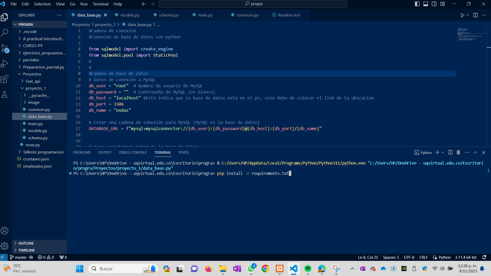

<h1 align="center">Problema de Física  </h1>
<h3 align="center">Aplicación de FastApi con Pydantic</h3>
<p align="center">


<details open="open">
     <summary>Tabla de Contenidos</summary>
      <ol>
      <li>
      <a href="#about-the-project">Acerca del proyecto</a>
      </li>
      <li>
      <a href="#Funcionamiento_general">Funcionamiento Generel</a>
      </li>
      <ul>
        <li><a href="#built-with">Realizado con</a></li>
      </ul>
      <li>
      <a href="#getting-started">Configuración inicial del proyecto</a>
      <ul>
        <li><a href="#prerequisites">Prerequisitos</a></li>
        <li><a href="#installation">Instalación</a></li>
      </ul>
    </li>
     <li>
      <a href="#problem">Explicación del problema</a>
      </li>
      <ul>
        <li><a href="#solution">Solución del problema Python</a></li>
      </ul>
      <li>
      <a href="#Database">Creación de la base de datos</a>
      </li>
      <ul>
        <li><a href="#built-with">Base de datos proyectos</a></li>
      </ul>
      <ul>
        <li><a href="#models">Models FastAPI</a></li>
      </ul>
       <ul>
        <li><a href="#modelsFastApi">Explicación modelos proyecto</a></li>
      </ul>
        <ul>
        <li><a href="#conecction">Conexión base de datos</a></li>
      </ul>
       <ul>
        <li><a href="#schema">Esquemas</a></li>
      </ul>
      <li>
      <a href="#main">Aplicación principal</a>
      </li>
      </ol>
</details>
</p>

<!-- ABOUT THE PROJECT -->
<p id="about-the-project">
</p>

## Acerca del proyecto

Este proyecto  utiliza las tecnologías FastAPI, Pydantic y SQLmodel para abordar un problema de física desde una perspectiva práctica y educativa. El objetivo de la iniciativa es fusionar la tecnología con los principios fundamentales de la física, proporcionando una plataforma única para la comprensión de conceptos  en esta disciplina.

Esta aplicación busca simplificar las complejidades de la física, haciéndolas accesibles para estudiantes, entusiastas y educadores por igual. A través de FastAPI, se ha creado una aplicación backend que permite la interacción intuitiva con conceptos físicos fascinantes. Pydantic garantiza la validación y serialización eficiente de datos, ofreciendo una experiencia de usuario sin errores. Mientras tanto, SQLmodel facilita la gestión de datos de manera efectiva.

<p id="Funcionamiento_general">
</p>

## Funcionamiento general del proyecto
La aplicación se ejecuta desde VScode, simplemente ejecutando el archivo "main" y accediendo a través del navegador mediante la URL http://127.0.0.1:9056/docs.

En pantalla, se encuentran los diferentes endpoints que conforman la aplicación, cada uno con su propia utilidad, que se explicará en detalle más adelante en este documento.

<p align="center">

</p>

<p id="built-with">
</p>


### Realizado con
* [Python](https://www.python.org/)
* [FastAPI](https://fastapi.tiangolo.com/)
* [XAMPP](https://www.apachefriends.org/es/index.html)
* [Vs code](https://code.visualstudio.com/)

<p id="getting-started">
</p>

## Configuración inicial del proyecto

Estas instrucciones permitirán la instalación de todas las librerias y programas necesarios para el correcto funcionamiento del proyecto.

<p id="prerequisites">
</p>

## Prerrequisitos
* Descargar e Instalar Vs Code
* Descargar e instalar Python 3.10.13
* Instalar XAMPP


<p id="installation">
</p>

## Instalación

Para descargar el proyecto y abrirlo en Vs code, siga estos pasos:

1. Descargue el proyecto a su computadora.
2. Abra Vscode.
3. Una vez abierto VsCode, haga clic en la terminal de Python.
4. Ingrese el siguiente comando: `pip install -r requirements.txt` y presione "Enter".
5. Con esta instrucción, se instalarán automáticamente todas las bibliotecas especificadas en el archivo `requirements.txt` que son necesarias para el funcionamiento del proyecto.

Nota: se puede crear un entorno virtual para la aplicación de manera que las intalaciones se realisarían de manera virtual.(Pero en este caso no se hizo porque por alguna extraña razon Vscode no me reconocia las librerias dentro del entorno)
<p align="center">

</p>

El paso siguiente consiste en abrir XAMPP y activar las opciones de MySQL y Apache.

Inicie XAMPP.
Haga clic en la opción para iniciar MySQL y Apache ("Start" o "Iniciar").
A continuación, se configura la base de datos:

Haga clic en la opción "Admin" junto a MySQL. Esto abrirá la página para la gestión de la base de datos en su navegador.
<p align="center">

</p>

Seleccione la opción "Nueva" para crear una nueva base de datos.

Asigne el nombre "ondas" a la base de datos y haga clic en "Crear".

Si ha seguido estos pasos de manera adecuada, la base de datos "ondas" se creará con éxito.
<p align="center">

</p>

Si ha realizado todos los pasos correctamente, al ejecutar el archivo "main.py" del proyecto, la aplicación debería ejecutarse sin problemas.
<p align="center">

</p>


<p id="problem">
</p>

**Problema: Interferencia de Ondas en una Rendija Doble**

**Introducción:**
Cuando las ondas se encuentran, pueden interferir entre sí, Hay dos tipos de inerfercia, la interferencia constructiva y la interferecnia destructiva. En el caso de una rendija doble, se pueden observar patrones de interferencia en una pantalla colocada a cierta distancia de las rendijas. Estos patrones de interferencia son el resultado de las ondas que pasan a través de las dos rendijas y se combinan en la pantalla.

**Fórmula clave:**
La intensidad luminosa en un punto de la pantalla debido a la interferencia de las ondas se puede calcular utilizando la siguiente fórmula:


<p align="center">I(x) = I0*cos^2(2*pi*d*sin(theta)\(lambda))
</p>

Donde:
- \(I(x)\) es la intensidad luminosa en un punto en la pantalla.
- \(I0\) es la intensidad máxima (cuando \(cos^2
(theta) = 1\)).
- \(d\) es la distancia entre las rendijas.
- \(theta\) es el ángulo de desviación de la onda con respecto a la dirección central.
- \(lambda\) es la longitud de onda de la luz.

**Teoría:**
Cuando las ondas de luz pasan a través de las rendijas, se generan dos fuentes de ondas secundarias, una desde cada rendija. Estas ondas secundarias se extienden en todas las direcciones y experimentan diferencias de fase a medida que viajan desde las rendijas hasta la pantalla.

La diferencia de fase entre las ondas secundarias depende del ángulo \(theta\) y está relacionada con la longitud de onda de la luz y la distancia entre las rendijas. Cuando la diferencia de fase es un múltiplo entero de \(2\pi\), las ondas se suman constructivamente y se obtiene una intensidad máxima. Cuando la diferencia de fase es un múltiplo impar de \(pi\), las ondas se suman destructivamente y se obtiene una intensidad mínima.

**Solución:**
Para resolver el problema, debes calcular la intensidad luminosa en la pantalla en función de la posición (\(x\)). Esto se hace calculando el ángulo \(theta\) para cada posición en la pantalla utilizando la relación \(x/D\), donde \(D\) es la distancia entre las rendijas y la pantalla. Luego, puedes utilizar la fórmula de intensidad luminosa para obtener la intensidad en cada punto.

El código proporcionado en la respuesta anterior realiza estos cálculos y muestra un gráfico del patrón de interferencia en la pantalla. Los valores de entrada que el usuario proporciona son la longitud de onda de la luz, la distancia entre las rendijas, la distancia a la pantalla y el número de puntos en la pantalla donde se calcula la intensidad. La intensidad se calcula para cada punto y se asegura de que no sea negativa antes de graficarla.

<p id="Database">
</p>

## Base de datos 

Las bases de datos relacionales son sistemas de gestión de datos que almacenan información en tablas organizadas de manera estructurada. Estas bases de datos utilizan un modelo de datos relacional que se basa en la teoría de conjuntos y relaciones matemáticas. Cada tabla representa una entidad o concepto, y las relaciones entre las tablas permiten establecer vínculos y consultas entre los datos.

Relaciones de Base de Datos:

**Relación Uno a Uno:** En una relación uno a uno, cada registro de una tabla se asocia con exactamente un registro en otra tabla. Esto se utiliza para representar relaciones donde la información se relaciona de manera única. Por ejemplo, una tabla de "Empleados" puede tener una relación uno a uno con una tabla de "Licencias de Conducir" si cada empleado tiene una única licencia de conducir.

**Relación Uno a Muchos (o Uno a N):** En una relación uno a muchos, un registro en una tabla se relaciona con varios registros en otra tabla. Esto se utiliza para representar relaciones donde un elemento puede tener múltiples asociaciones. Por ejemplo, una tabla de "Clientes" puede tener una relación uno a muchos con una tabla de "Órdenes" si un cliente puede realizar varias órdenes.

**Relación Muchos a Muchos:** En una relación muchos a muchos, varios registros en una tabla se relacionan con varios registros en otra tabla. Para representar este tipo de relación, se utiliza una tabla intermedia que conecta las dos tablas principales. Por ejemplo, una tabla de "Estudiantes" puede estar relacionada con una tabla de "Cursos" a través de una tabla intermedia "Inscripciones" que registra qué estudiantes están inscritos en qué cursos.


En FastAPI, los modelos (models), SQLModel y Pydantic son conceptos fundamentales relacionados con la definición de estructuras de datos y la manipulación de bases de datos. Aquí te explico qué son y su función en FastAPI:

<p id="problem">
</p>

## Models

1. Models (Modelos):

En FastAPI, un "modelo" se refiere a una clase de Python que define la estructura de los datos utilizados en la API. Estos modelos son esenciales para dos aspectos principales:

Validación de Datos: Los modelos permiten definir la estructura de los datos que se envían o reciben en las solicitudes HTTP. Esto ayuda a asegurarse de que los datos cumplan con ciertos criterios, como tipos de datos, valores requeridos o patrones específicos, antes de ser procesados. Esto garantiza que los datos sean válidos y seguros.

Serialización de Datos: Los modelos también se utilizan para serializar (convertir en formato JSON) los datos en las respuestas HTTP. Esto facilita la entrega de datos estructurados en las respuestas de la API.

FastAPI utiliza Pydantic, una biblioteca de validación de datos, para definir y trabajar con modelos. Pydantic simplifica la creación de modelos y proporciona una validación automática de datos en tiempo de ejecución.

2. SQLlmodel:

SQLModel es una biblioteca de Python que se utiliza para interactuar con bases de datos relacionales. En el contexto de FastAPI, SQLmodel desempeña las siguientes funciones:

Mapeo Objeto-Relacional (ORM): SQLmodel permite definir modelos de datos en la base de datos como clases de Python. Estos modelos se denominan "clases de modelo" y se mapean a tablas en la base de datos. Esto facilita la creación y manipulación de registros de la base de datos utilizando objetos de Python en lugar de SQL directo.

Operaciones CRUD: SQLmodel proporciona métodos y herramientas para realizar operaciones en la base de datos, como consultas, insertaciones, actualizaciones y eliminaciones. Esto se hace de manera programática a través de las clases de modelo en lugar de escribir SQL directamente.

Abstracción de la Base de Datos: SQLlModel proporciona una capa de abstracción sobre diferentes tipos de bases de datos, lo que facilita cambiar de una base de datos a otra sin cambiar el código de la aplicación.

3. Pydantic:

Pydantic es una biblioteca que se utiliza en FastAPI para definir modelos y realizar validación de datos. Sus funciones principales son:

Definición de Modelos: Pydantic permite definir modelos de datos de manera sencilla utilizando clases de Python. Estos modelos incluyen información sobre los tipos de datos y las validaciones necesarias para cada atributo.

Validación Automática: Pydantic realiza validaciones automáticas de datos en tiempo de ejecución, asegurándose de que los datos cumplen con las reglas definidas en los modelos.

Serialización y Deserialización: Pydantic puede convertir datos en objetos Python y viceversa, lo que facilita la manipulación de datos en las solicitudes y respuestas de la API.

En resumen, en FastAPI, los "modelos" se utilizan para definir la estructura de datos y validarlos en las solicitudes HTTP, mientras que "SQLModel" se utiliza para interactuar con bases de datos relacionales y realizar operaciones en la base de datos utilizando objetos de Python en lugar de SQL directo. "Pydantic" simplifica la creación de modelos y realiza validación de datos en tiempo de ejecución. Estos tres conceptos trabajan juntos para crear APIs seguras y eficientes en FastAPI.

Apartir de la información anterior, los models de la aplicación quedan de la siguiente manera.

<p id="modelsFastApi">
</p>

## Model del proyecto

El código define tres clases python que representan tablas de una base de datos utilizando SQLmodel, una biblioteca de mapeo objeto-relacional (ORM) en Python. Esta diseñado para representar relaciones entre tres tablas: 'imageResult', 'parameter' y 'result'. 

1. Importaciones:
   ```python
   from datetime import datetime
   from sqlmodel import Field, SQLModel, Relationship
   from typing import List
   ```

   - Se importa `datetime` para trabajar con fechas y horas.
   - Se importa `Field` de `sqlmodel`para mapear las columnas de una base de datos, validar el tipo de datos de la columna, si es str, int o float, la clave primaria y el valor determinado
   - Se importa `SQLModel` de `sqlmodel` para indicarle a python que los modelos de datos representan tablas (Basicamente para crear tablas)
   - Se importa `Relationship` para poder hacer relaciones entre las tablas
   - Se importa `List` de `typing` para indicarle a python que una variable o argumento debe ser una lista que contiene datos especificos


2. Clase `ImageResult`:
    guarda la URL de la imagen resultante de cada medida que se realiza en el proyecto para encontrar la intensidad luminosa.
   - Esta clase representa la tabla 'imageResult' en la base de datos al usar `(SQLModel, table=True)` indica que es una tabla de una base de datos que usa las cualidades de SQLmodel para trabajar con bases de datos SQL,
   - Se definen las columnas de la tabla: `id`, `urlImagen` y `created_at`.
   - La columna `id` es una clave primaria de tipo entero.
   - La columna `urlImagen` es de tipo cadena (String) con una longitud máxima de 255 caracteres.
   - La columna `created_at` es de tipo DateTime y tiene un valor predeterminado que se establece en la fecha y hora actual cuando se crea un registro en esta tabla.
   - Se define una relación uno a uno con la clase `Parameter` utilizando la función `relationship`.

3. Clase `Parameter`:
Gurda los parametros necesarios para encontrar la intesidad luminosa, esto para llevar un registro de los parameros usados para la solción del problema.
   - Esta clase representa la tabla 'parameter' en la base de datos, Al igual que la anterior usa `(SQLModel, table=True)` para indicar que es una tabla de una base de datos
   - Se definen las columnas de la tabla: `id`, `lambda_`, `distanceGrids`, `distanceScreen`, `NumberPoints`, y `created_at`.
   - La columna `id` es una clave primaria de tipo entero.
   - Las columnas `lambda_`, `distanceGrids`, y `distanceScreen` son de tipo Float.
   - La columna `NumberPoints` es de tipo entero.
   - La columna `created_at` es de tipo DateTime y tiene un valor predeterminado que se establece en la fecha y hora actual cuando se crea un registro en esta tabla.
   - Se define una relación uno a uno con la clase `ImageResult` utilizando la función `relationship`.
   - También se define una relación uno a muchos con la clase `Result` utilizando la función `relationship`.

4. Clase `Result`:
Se encarga de guardad las soluciones encontradas dado unos parametros.
   - Esta clase representa la tabla 'result' en la base de datos.
 `PointX`, y `created_at`.
   - La columna `id` es una clave primaria de tipo entero.
   - Las columnas `intensity` y `PointX` son de tipo Float.
   - La columna `created_at` es de tipo DateTime y tiene un valor predeterminado que se establece en la fecha y hora actual cuando se crea un registro en esta tabla.
   - Se define una relación muchos a uno con la clase `Parameter` utilizando la función `relationship`.

En resumen, este código define las estructuras de tres tablas de base de datos ('imageResult', 'parameter' y 'result') y las relaciones entre ellas utilizando SQLModel. Esto permite crear, consultar y manipular registros en la base de datos de manera orientada a objetos en Python.


<p id="conecction">
</p>

## Conexión base de datos

Este código se encarga de configurar la conexión a una base de datos MySQL utilizando SQLModel, una biblioteca de mapeo objeto-relacional (ORM) en Python. A continuación, se explica en detalle lo que hace cada parte del código:

1. Importaciones:
   ```python
   from sqlmodel import create_engine
   from sqlmodel.pool import StaticPool
   ```
   - Se importa la clase `create_engine` de SQLmodel, que se utiliza para crear un motor de base de datos que gestionará la conexión a la base de datos.
   - Se importa la clase `StaticPool` de `sqlmodel.pool` Para hacer mas eficiente la conexion a base de datos, mantiene una conexion abierta a base de datos que se puede utilizar.
2. Datos de conexión a MySQL:
   ```python
   db_user = "root"  # Nombre de usuario de MySQL
   db_password = ""  # Contraseña de MySQL (en blanco)
   db_host = "localhost:3306"  # La dirección del servidor MySQL (en este caso, local)
   db_name = "ondas"
   ```
   - Se definen los datos necesarios para la conexión a la base de datos MySQL. Esto incluye el nombre de usuario (`db_user`), la contraseña (`db_password`), la dirección del servidor y el puerto (`db_host`), y el nombre de la base de datos (`db_name`).

3. Crear una cadena de conexión para MySQL:
   ```python
   DATABASE_URL = f"mysql+mysqlconnector://{db_user}:{db_password}@{db_host}:{db_port}/{db_name}"

   ```
   - Se crea una cadena de conexión (`DATABASE_URL`) utilizando la información proporcionada anteriormente. Esta cadena se utiliza para especificar la ubicación y las credenciales de la base de datos a la que se desea conectar.

4. Crear un motor de base de datos:
   ```python
   engine = create_engine(DATABASE_URL, poolclass=StaticPool)
   ```
   - Se crea un motor de base de datos utilizando la cadena de conexión `DATABASE_URL`. El motor se encargará de gestionar la conexión a la base de datos MySQL.


En resumen, este código configura la conexión a una base de datos MySQL utilizando SQLModel, prepara una instancia de sesión de SQLModel para interactuar con la base de datos y crea una clase base declarativa para definir las estructuras de las tablas en la base de datos de manera orientada a objetos en Python.

<p id="schema">
</p>

## Esquemas

Este código define dos clases utilizando Pydantic, una biblioteca de validación y serialización de datos en Python. Las clases `ParameterRequest` y `ResultRequest` se utilizan para definir modelos de datos y validar los datos de entrada. A continuación, se explica en detalle lo que hace cada parte del código:

1. Importaciones:
   ```python
   from pydantic import BaseModel, Field
   ```
   - Se importa la clase `BaseModel` de Pydantic, que se utiliza como base para definir modelos de datos.
   - Se importa la clase `Field` de Pydantic, que se utiliza para especificar restricciones sobre los campos de los modelos.

2. Clase `ParameterRequest`:
   - Esta clase hereda de `BaseModel` y se utiliza para definir un modelo de datos para los parámetros de solicitud. Los datos de entrada se validarán según las reglas definidas en esta clase.
   - Se definen los campos de la clase, cada uno con un nombre y un tipo de dato, y se aplican restricciones utilizando `Field`.
     - `lambda_`: Un campo de tipo float con una restricción `gt=0`, lo que significa que debe ser un número flotante mayor que 0.
     - `distanceGrids`: Un campo de tipo float con la misma restricción `gt=0`.
     - `distanceScreen`: Un campo de tipo float con la misma restricción `gt=0`.
     - `NumberPoints`: Un campo de tipo entero (int) con la misma restricción `gt=0`.


Estas dos clases de Pydantic se utilizan para garantizar que los datos de entrada cumplan con las restricciones especificadas antes de ser procesados en una aplicación. Ayudan a garantizar que los datos sean válidos y útiles antes de ser utilizados en operaciones posteriores.

<p id="solution">
</p>

## Solución del problema de fisíca con python

Este código es una implementación en Python de funciones que calculan la intensidad luminosa de un patrón de difracción producido por una rendija o una doble rendija. Las funciones `calculate_intensity` y `calculate_intensity_for_point` se utilizan para calcular la intensidad luminosa en diferentes puntos de una pantalla. Aquí tienes una descripción detallada de lo que hace cada parte del código:

1. Importaciones:
   ```python
   import numpy as np

   ```
   - Se importa la biblioteca NumPy (`numpy`) para realizar cálculos numéricos.


2. `calcular_intensidad`:
   - Esta función calcula la intensidad luminosa en un punto específico en la pantalla en un patrón de difracción.
   - Toma cuatro argumentos: `x`, `d`, `D`, y `lambda_`.
     - `x` es la posición en la pantalla donde se desea calcular la intensidad.
     - `d` es la distancia entre las rendijas.
     - `D` es la distancia entre las rendijas y la pantalla.
     - `lambda_` es la longitud de onda de la luz incidente.
   - La función calcula el ángulo `theta` utilizando la ley de Snell (arcsin).
   - Luego, calcula la intensidad `I` utilizando la fórmula de difracción, que involucra el coseno del término de interferencia.
   - Retorna la intensidad calculada en ese punto.

3. `calcular intensidad por puntos`:
   - Esta función calcula la intensidad luminosa en varios puntos en la pantalla y devuelve una lista de intensidades junto con las posiciones en la pantalla.
   - Toma cuatro argumentos: `d`, `D`, `lambda_`, y `N`.
     - `d` es la distancia entre las rendijas o la rendija única.
     - `D` es la distancia entre la rendija o la rendija única y la pantalla.
     - `lambda_` es la longitud de onda de la luz incidente.
     - `N` es la cantidad de puntos en la pantalla para los cuales se calculará la intensidad.
   - Utiliza NumPy para generar un conjunto de puntos `x_points` igualmente espaciados en la pantalla, que abarca desde `-0.5 * D` hasta `0.5 * D`.
   - Luego, calcula la intensidad en cada punto utilizando la función `calcular intensidad`, asegurándose de que la intensidad no sea negativa (se establece en cero si es negativa).
   - Retorna dos listas: una con las posiciones `x_puntos` y otra con las intensidades calculadas para cada posición.

En resumen, estas funciones se utilizan para calcular la intensidad luminosa en una pantalla en un patrón de difracción, como el producido por una rendija simple o doble. Los cálculos se basan en principios de óptica y se realizan de manera numérica utilizando NumPy.

<p id="main">
</p>

## Aplicación principal 

Este código es una aplicación de FastAPI que proporciona una API para realizar cálculos y almacenar resultados relacionados con la difracción de la luz en una rendija doble. La aplicación realiza tareas como crear registros en una base de datos, calcular patrones de interferencia y servir estos datos a través de una API web. Aquí tienes una descripción detallada de lo que hace cada parte del código:

1. Importaciones:
   ```python
   import uvicorn 
   from fastapi import FastAPI, Depends, HTTPException, Path,  status
   from datetime import datetime
   from data_base import engine
   from sqlmodel import SQLModel
   from sqlmodel import Session, create_engine
   from models import Parameter,Result, ImageResult
   from sqlmodel.sql.expression import select
   from matplotlib import pyplot as plt
   from schema import ParameterRequest
   from common import
   ```
- Se importa `Uvicorn` que es el encargado de crearnos un servidor web en el que vamos a ejecutar nuestra Api
- Se importa `FastApi` de `fastapi` y nos permite crear rutas http (Es lo que nos permite usar GET, POST, PUT DELETE)
- Se importa `Depends` de `fastapi` abre una sesion en la base de datos para poder operar en ella
- Se importa `HTTPException` de `fastapi` y se encarga de darnos los errores de excepciones 
- Se importa `Path` de `fastapi` valida parametros en la ruta 
- Se importa `status` de `fastapi`, es un completemnto de HTTPException, este se encarga de darnos los mensajes de error()
- Se importa `datetime` de `datatime` y sirve para trabajar con fechas 
- Se importa `engine` de `data_base` (Ese `engine` lo creamos en el apartado de data_base)
- Se importa `sqlmodel` de `SQLModel` #NOTA: NO ME ACUERDO QUE HACE ESTA IMPORTACION
- Se importa `Session` de `sqlmodel` se encarga del inicion y cierre automatico de las bases de datos
- Se importa `Create_engine` de `sqlmodel` que anteriormente habiamos dicho que se utiliza para crear un motor de base de datos que gestionará la conexión a la base de datos
- Se importa `Parameter`, `Result`,`ImageResult` de nuestro apartado `models` para poder acceder a esas clases
- Se importa `select` de `sqlmodel.sql.expression` y es el que nos permite hacer consulas en la base de datos
- Se importa `pyplot` de `matplotlin` y es la ecargada de hacer las graficas
- Se importa `ParameterRequest` de nuestro apartado schema
- Se importa los parametros `calcular_intensidad, calcular_intensidad_por_puntos` de nuestro apartado de common
2. Creación de la aplicación FastAPI
   ```python
   app = FastAPI()
   ```
   - Se crea una instancia de la aplicación FastAPI que se utilizará para definir las rutas y controladores.

3. Creación de tablas en la base de datos:
   ```python
   SQLModel.metadata.create_all(engine)
   ```
   - Se crea la estructura de las tablas en la base de datos utilizando SQLmodel y las definiciones de modelos en el módulo `SQLModel`.

4. Definición de una función `get_session`:
   - Se define una función llamada `get_session` que se utiliza para obtener una sesión de la base de datos. La sesión se crea y se cierra automáticamente en un bloque `try...finally` utilizando un generador.

5. Definición de rutas y controladores:
   - Se definen múltiples rutas y controladores en la aplicación FastAPI para realizar diversas operaciones, como leer parámetros, crear gráficos de patrones de interferencia, almacenar resultados en la base de datos y servir datos a través de la API.

7. Ejecución de la aplicación:
   - La aplicación FastAPI se ejecuta utilizando Uvicorn en el bloque `if __name__ == "__main__"`. La aplicación se inicia en el puerto 9056 y permite recargar el servidor automáticamente en caso de cambios.

Resumiendo, este código crea una aplicación web con FastAPI que permite realizar cálculos de difracción de luz, guardar resultados en una base de datos, y servir estos datos a través de una API. La aplicación es flexible y se puede acceder a través de rutas específicas para realizar diversas operaciones relacionadas con la difracción de la luz. Además, se generan gráficos de patrones de interferencia y se almacenan en una ubicación especificada.
